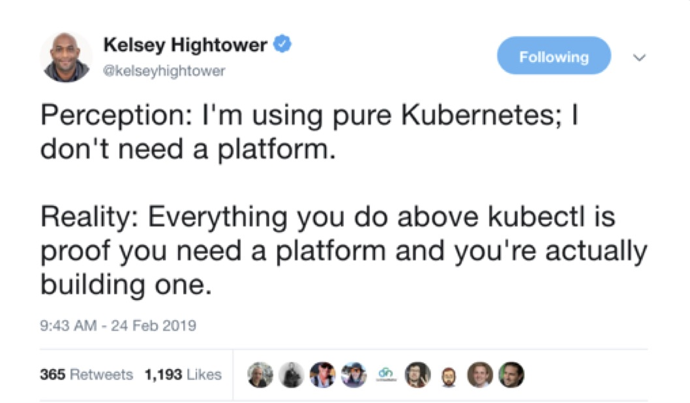

== Running with persistence in Kubernetes

For the sake of time, we'll skip deploying the app again to Kubernetes, but think about the various considerations you'd have to make:

== Source of Database

How will we install our database in Kubernetes?

. We can install a database directly as an image like we just did locally, but that would present issues for upgrades, auditing etc.
. We can use helm charts. Who would be responsible for upgrading them?
. We can purchase database solutions based on Kubernetes operators / CRDs from a well-known vendor. The amount of production ready solutions is still low (Confluent, Greenplum, MongoDB).

Regardless of the solution, we need to think of the following:

. We need to make sure that _only_ our application can access the database and no other pods. This requires Kubernetes _taint_ commands using labels.
. We need to update our application to point to the new database URL, username and password.
. We need to do this every time we move to other environments (such as other namespaces or Kubernetes clusters).
. We need to store password in a well-encrypted store. The default kubernetes secret management uses base64 encoding *which is not an encryption solution*

= The bottom line

*If you got all of the requirements above working in a production-ready manner, congradulations - you built your own platform on top of Kubernetes*!

+
image::images/k8s1.jpg[]
+

+
image::images/k8s3.jpg[]

