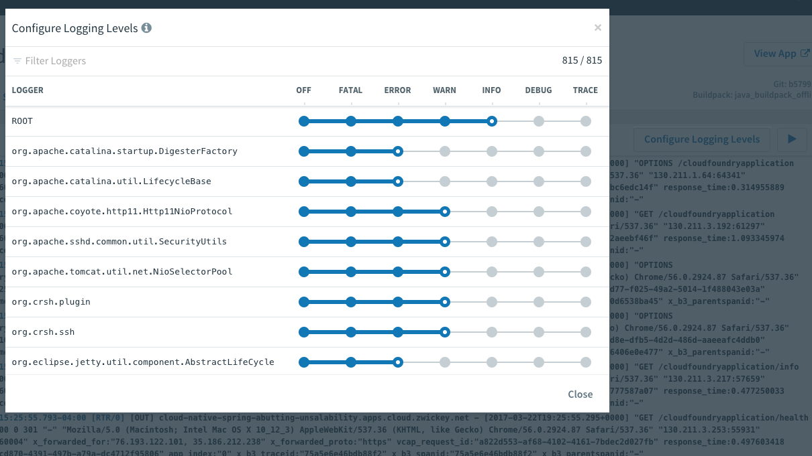

= Deploy _cloud-native-spring_ to Pivotal Cloud Foundry

We've built and run the application locally.  Now we'll deploy it to Cloud Foundry.

. Create an application manifest in the root folder _devops-workshop/labs/my_work/cloud-native-spring_
+
  touch manifest.yml

. Add application metadata, using a text editor (of choice)
+
[source,bash]
---------------------------------------------------------------------
---
applications:
- name: cloud-native-spring
  random-route: true
  path: ./build/libs/cloud-native-spring-1.0-SNAPSHOT.jar
  buildpacks:
  - java_buildpack_offline   #(This can be automatically detected, but faster if provided)
---------------------------------------------------------------------
+
The above manifest entries will work with Java Buildpack 4.x series and JDK 8.  If you built the app with JDK 11 and want to deploy it you will need to make an additional entry in your manifest, just under `buildpacks`, addand environment variable:
+
[source,bash]
---------------------------------------------------------------------
  env:
    JBP_CONFIG_OPEN_JDK_JRE: '{ jre: { version: 11.+ } }'
---------------------------------------------------------------------

. Push application into Cloud Foundry
+
[source,bash]
---------------------------------------------------------------------
cf push
---------------------------------------------------------------------
+
-> To specify an alternate manifest and buildpack, you could run something like this:
+
[source,bash]
---------------------------------------------------------------------
  cf push -f my-other-manifest.yml -b java_buildpack
---------------------------------------------------------------------

. Find the URL created for your app in the health status report. Browse to your app's `/hello` endpoint.

. Check the log output
+
[source,bash]
---------------------------------------------------------------------
cf logs cloud-native-spring --recent
---------------------------------------------------------------------

. How fast would it be to change one line in our code and have it running in production?

== Exploring actuator in Apps Manager

. When running a Spring Boot application on Pivotal Cloud Foundry with the actuator endpoints enabled, you can visualize actuator management information on the Applications Manager app dashboard.  To enable this there are a few properties we need to add.  Add the following to */cloud-native-spring/src/main/resources/application.yml*:

. Push application into Cloud Foundry
+
  gradle build
  cf push

. Visit the route created for your app and append /actuator/health to see the health status report. See the same details in the Apps Manager UI:
+
image::images/appsman.jpg[]

. From this UI you can also dynamically change logging levels:
+

*Congratulations!* You’ve just learned how to add health and metrics to any Spring Boot application.

