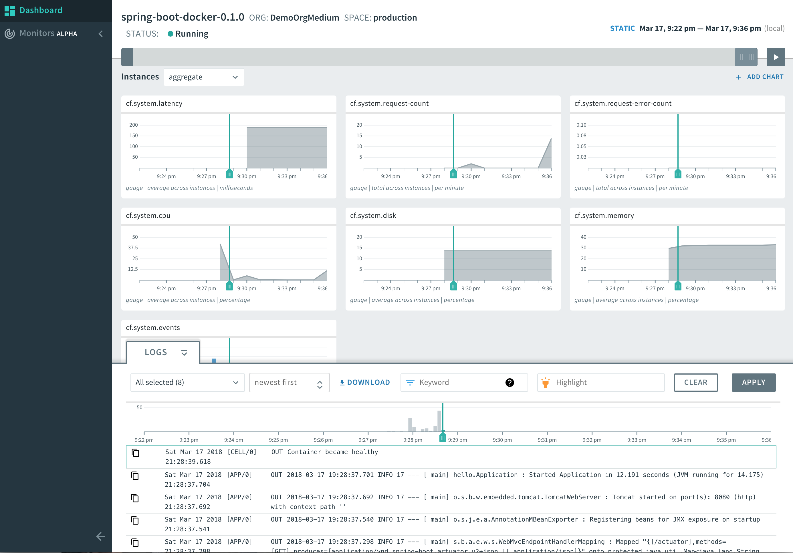

= 09. Deploy app with persistence to Pivotal Cloud Foundry

We've built and run the application locally.
We deployed our application to Kubernetes.
Now we'll deploy it to Cloud Foundry.
Our application needs to use a MySQL database. How will we deploy one to PCF? Simple, we'll use the marketplace:

. Run the following command to review the various services availble in the marketplace:
+
[source,bash]
---------------------------------------------------------------------
cf marketplace
---------------------------------------------------------------------
+
. Review the various plans that are available for the `mysql` service:
+
[source,bash]
---------------------------------------------------------------------
cf marketplace -s p.mysql
---------------------------------------------------------------------
+
. Let's create a small MySQL Database:
+
[source,bash]
---------------------------------------------------------------------
cf create-service p.mysql db-small my-database
---------------------------------------------------------------------
+
. Our database is being created. You can check its status by running:
+
[source,bash]
---------------------------------------------------------------------
cf service my-database
---------------------------------------------------------------------
+
-> All of these can also be done directly from the Apps Manager GUI. Go to the Marketplace link on the left-hand side.
-> Who was responsible for creating this database? It the operations team, not the development team. They added the service from the Pivotal Marketplace. The MySQL service in this case is a supported service from Pivotal. It also handles upgrades, backups, self-healing, monitoring with Healthwatch, auditing, and many other tasks that are not immediatly obvious.

. Create an application manifest in the root folder _devops-workshop/labs/my_work/cloud-native-spring_
`touch manifest.yml`

. Add application metadata, using a text editor (of choice)
+
[source,bash]
---------------------------------------------------------------------
---
applications:
- name: cloud-native-spring
  random-route: true
  path: ./build/libs/cloud-native-spring-1.0-SNAPSHOT.jar
  services:
  - my-database
  env:
    JBP_CONFIG_OPEN_JDK_JRE: '{ jre: { version: 11.+ } }'
---------------------------------------------------------------------
+
-> Notice the simplifed configuration file? We reduced 133 lines in Kubernetes to just 8 lines in PCF.
+
-> Notice the service in the `manifest.yml`? It's the service we just created. *That's all you need to do to make the connection between the application and the service*. Remember how much work that required in Kubernetes?

. Push application into Cloud Foundry
+
[source,bash]
---------------------------------------------------------------------
cf push
---------------------------------------------------------------------
+
-> To specify an alternate manifest and buildpack, you could run something like this:
+
[source,bash]
---------------------------------------------------------------------
cf push -f my-other-manifest.yml -b java_buildpack
---------------------------------------------------------------------
+
. Check the `start command` at the end of the log deployment:
+
[source,bash]
---------------------------------------------------------------------
JAVA_OPTS="-agentpath:$PWD/.java-buildpack/open_jdk_jre/bin/jvmkill-1.16.0_RELEASE=printHeapHistogram=1 -Djava.io.tmpdir=$TMPDIR -XX:ActiveProcessorCount=$(nproc)
  -Djava.ext.dirs=$PWD/.java-buildpack/container_security_provider:$PWD/.java-buildpack/open_jdk_jre/lib/ext
  -Djava.security.properties=$PWD/.java-buildpack/java_security/java.security $JAVA_OPTS" &&
  CALCULATED_MEMORY=$($PWD/.java-buildpack/open_jdk_jre/bin/java-buildpack-memory-calculator-3.13.0_RELEASE -totMemory=$MEMORY_LIMIT -loadedClasses=16787
   -poolType=metaspace -stackThreads=250 -vmOptions="$JAVA_OPTS") && echo JVM Memory Configuration: $CALCULATED_MEMORY && JAVA_OPTS="$JAVA_OPTS $CALCULATED_MEMORY" &&
   MALLOC_ARENA_MAX=2 SERVER_PORT=$PORT eval exec $PWD/.java-buildpack/open_jdk_jre/bin/java $JAVA_OPTS -cp $PWD/. org.springframework.boot.loader.JarLauncher
---------------------------------------------------------------------
+
. The reason for this long start command is that PCF optimizes the container and the JVM for production use. That includes running a memory calculator as part of the deployment to understand the optimal memory settings for the JVM, along with other fine-tuning. As you recall, our start command in the Dockerfile was simply `java -jar app.jar`. Notice how many things need to be taken into consideration when you need to be production ready!

. Find the URL created for your app in the health status report. Browse to your app's `/hello` endpoint.

. Check the log output
+
[source,bash]
---------------------------------------------------------------------
cf logs cloud-native-spring --recent
---------------------------------------------------------------------
+
. Check the `/cities` endpoint by going to `https://<your-specific-route>/cities`.
Wait a minute! How did this even work?! We didn't update the properties under `src/main/resources/application.yml`, yet somehow our app created the `city` table and populated it on startup using flyway. Not only that - we didn't even need to create a schema manually! How is that possible? That's the power of the *Open Service Broker API (OSBAPI)*.
+
. To fully understand this magic, run the following command:
`cf env cloud-native-spring`
+
. Notice the `p.mysql` entry under `VCAP_SERVICES`? That was injected when we told our application that we'd like to *bind* our app to the `my-database` service. Binding provides all the environment variables needed to connect to the database (or any other service, such as a message broker). Even more impressive - Spring (and .NET with Steeltoe) knows how to autoconfigure itself and bind to this new database auto-magically. The parameters injected by the platform will override the settings in your `application.yml`, so your code will always remain portable. Eventially you'll move to a production environment and bind to a different database instance called `my-database`, but that's ok - all the parameters would be injected again, no code changes or recompile is required.
+
. Perhaps even more important - you no longer have passwords scattered all over your code and your environment. *Only* users that are authoried to access this particular space and app will have the option to view the parameters of the database that includes the password. You can also leverage a PCF service called _Credhub_, which is an encrypted database for properties. If you were to use Credhub, you wouldn't even see the parameters when running `cf env`. *Only* the application's PID process would be able to automatically fetch the parameters on container startup.
+
. How fast would it be to change one line in our code and have it running in "production"? Let's change `GreetingController.java` to greet us with `Hello VMware on PCF!`. All that's left to do is:

`./gradlew build && cf push`

Check the updated results under `https://<your-specific-route>/hello`

== Exploring actuator in Apps Manager

. When running a Spring Boot (or .NET with Steeltoe) application on Pivotal Cloud Foundry with the actuator endpoints enabled, you can visualize actuator management information in the Apps Manager dashboard.

. Visit the route created for your app and append /actuator/health to see the health status report. See the same details in the Apps Manager UI:
+
image::images/appsman.jpg[]

The Logs tab provides an *aggregated* view of all logs from all instances on our application. You can also change the logging level per class/package at runtime without having to restart:

image::images/logging.png[]

The Trace tab shows you the recent REST API calls made to your application:

image::images/trace.png[]

The Threads tab provides visibility into all threads currently running in your JVM. You can also download a heap dump for offline investigation:

image::images/threads.png[]

From the overview screen, clicking on PCF Metrics takes you to a full-blown monitoring dashboard where you can correlate system events along with the logs that happened at that time. Excellent for troubleshooting.

*Congratulations!* You’ve just deployed a full-blown application to PCF along with a supporting database!

