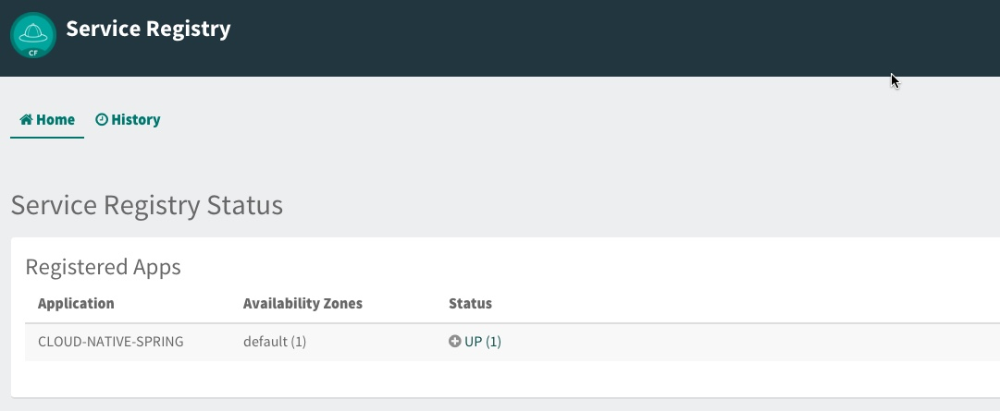
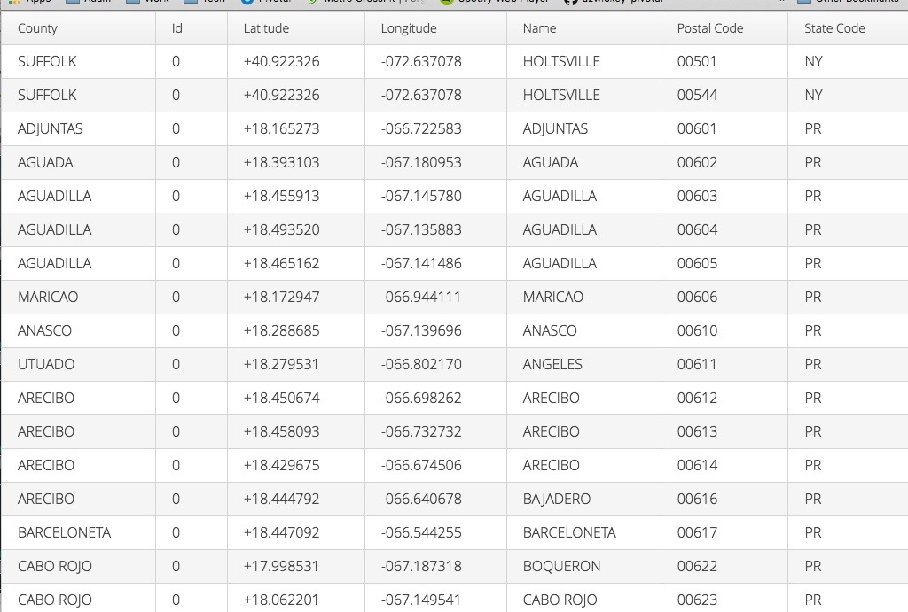

= 11. Adding Service Registration and Discovery with Spring Cloud

In this lab we'll utilize Spring Boot and Spring Cloud to configure our application register itself with a Service Registry.  To do this we'll also need to provision an instance of a Eureka service registry using Pivotal Cloud Foundry Spring Cloud Services.  We'll also add a simple client application that looks up our application from the service registry and makes requests to our Cities service.

== Update _Cloud-Native-Spring_ Boot Application to Register with Eureka

. These features are added by adding _spring-cloud-services-starter-service-registry_ to the classpath. Open your Gradle build file, found here: */cloud-native-spring/build.gradle*. Add the following spring cloud services dependency:
+
[source,groovy]
---------------------------------------------------------------------
dependencies {
	// add this dependency
	implementation('io.pivotal.spring.cloud:spring-cloud-services-starter-service-registry')
}

---------------------------------------------------------------------
+

. Thanks to Spring Cloud instructing your application to register with Eureka is as simple as adding a single annotation to your app! Add an _@EnableDiscoveryClient_ annotation to the class _io.pivotal.CloudNativeSpringApplication_ (/cloud-native-spring/src/main/java/io/pivotal/CloudNativeApplication.java):
+
[source,java]
---------------------------------------------------------------------
@SpringBootApplication
@EnableDiscoveryClient
public class CloudNativeSpringApplication {
---------------------------------------------------------------------

== Create Spring Cloud Service Registry instance and deploy application

. Now that our application is ready to registr with an Eureka instance, we need to deploy one!  This can be done through Cloud Foundry using the services Marketplace.  Previously we did this through the Marketplace UI. This time around we will use the Cloud Foundry CLI:
+
[source,bash]
---------------------------------------------------------------------
cf create-service p-service-registry standard service-registry
---------------------------------------------------------------------

. After you create the service registry instance navigate to your Cloud Foundry space in the Apps Manager UI and refresh the page.  You should now see the newly create Service Registry intance.  Select the Manage link to view the registry dashboard.  Note that there are not any registered applications at the moment:
+
image::images/registry1.jpg[]

. We will now bind our application to our service-registry within our Cloud Foundry deployment manifest.  Add an additional reference to the service at the bottom of */cloud-native-spring/manifest.yml* in the services list:
+
[source,yml]
---------------------------------------------------------------------
  services:
  - config-server
  - service-registry
---------------------------------------------------------------------

== Deploy and test application

. Build the application
+
[source,bash]
---------------------------------------------------------------------
./gradlew build
---------------------------------------------------------------------

. Push application into Cloud Foundry
+
[source,bash]
---------------------------------------------------------------------
cf push
---------------------------------------------------------------------

. If we now test our application URLs we will notice no significatnt changes.  However, if we view the Service Registry dashboard (accessible from the _Manage_ link in Apps Manager) you will see that a service named cloud-native-spring has registered:
+

. Next we'll create a simple UI application that will read from the Service Registry to discover the location of our cities REST service and connect.

== Create another Spring Boot Project as a Client UI

As in Lab 1 we will start with a project that has most of what we need to get going.

. Open a Terminal (e.g., _cmd_ or _bash_ shell)

. Change the working directory to be _devops-workshop/labs/my_work/cloud-native-spring-ui_
+
  cd devops-workshop/labs/my_work/cloud-native-spring-ui
+

== Deploy and test application

. Build the application.  We have to skip the tests otherwise we may fail because of having 2 spring boot apps on the classpath
+
[source,bash]
---------------------------------------------------------------------
./gradlew build -x test
---------------------------------------------------------------------
+
-> Note that we're skipping tests here (because we now have a dependency on a running instance of _cloud-native-spring_).

. Create an application manifest in the root folder /cloud-native-spring-ui
+
$ touch manifest.yml

. Add application metadata
+
[source, bash]
---------------------------------------------------------------------
---
applications:
- name: cloud-native-spring
  random-route: true
  path: ./build/libs/cloud-native-spring-ui-1.0-SNAPSHOT.jar
  services:
  - my-database
  env:
    JBP_CONFIG_OPEN_JDK_JRE: '{ jre: { version: 11.+ } }'
  services:
  - service-registry
---------------------------------------------------------------------

. Push application into Cloud Foundry
+
[source,bash]
---------------------------------------------------------------------
cf push
---------------------------------------------------------------------

. Test your application by navigating to the `/` endpoint, which will invoke the Vaadin UI.  You should now see a table listing the first set of rows returned from the cities microservice:
+

