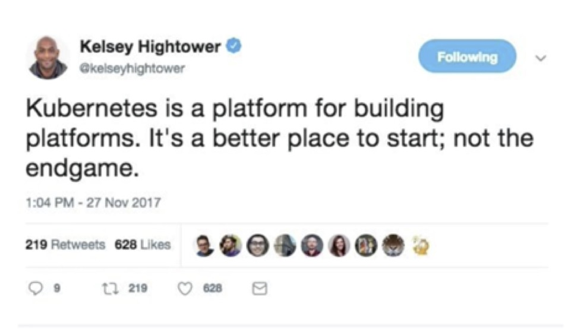

== Adding a database

Our application now needs a database. What will we install?
. We can install a database directly as an image.
. We can use helm charts. Who takes care of the upgrades?
. We can use database solutions as kubernetes operators / CRDs from a well-known vendor. The amount of production ready solutions is still low (Confluent, Greenplum, MongoDB).

Regardless of the solution, we need to configure the following:
. We need to make sure that _only_ our application can access the database and no other pods. This requires Kubernetes _taint_ commands using labels.
. We need to update our application to point to the new database URL, username and password.
. We need to do this every time we move to other environments (such as other namespaces or Kubernetes clusters).
. We need to store password in a well-encrypted store. The default kubernetes secret management uses base64 encoding *which is not an encryption solution*

== Installing a management GUI

It would be nice to install a web UI to manage our kubernetes deployments.
. We can use the default Kubernetes dashboard.
. We can install desktop solutions such as Lens.
. Almost all of these solutions focus on the Kubernetes native components (pods, deployments, services) and not on the application-specific perspective (Apps, logs, metrics).

= The bottom line: If you got all of the requirements above working well, congradulations - you built your own platform on top of Kubernetes!

+

+
image::images/k8s2.jpg[]
+
image::images/k8s3.jpg[]

